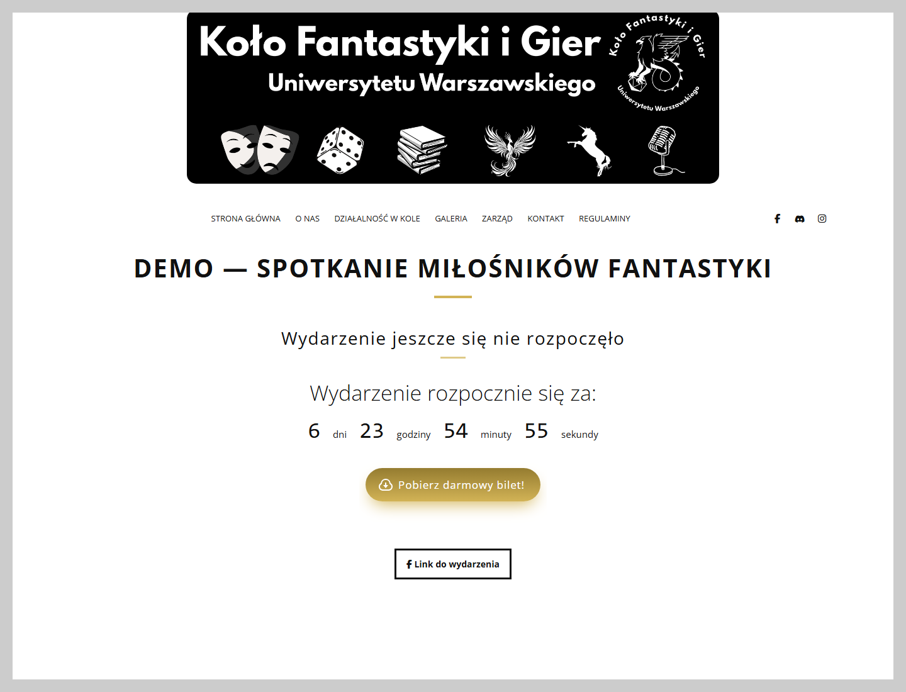

# Koło Fantastyki i Gier UW

A website for the University of Warsaw's fantasy and gaming club, with event information and a free ticket system. Visitors download a PDF ticket with a QR code that staff can verify after signing in.

The application interface is in Polish, as it was built for a Polish university club.



## Features

- Club information, photo gallery and event rules.
- Event management through Django admin and a countdown to each event.
- PDF tickets with QR codes and staff verification.
- Contact form with input validation and a submission limit.

## Technologies

Python 3.13+ · Django 5.2 · PostgreSQL 17 · Docker Compose · Gunicorn · Nginx · Tailwind CSS · ReportLab · qrcode

## How tickets work

Each ticket receives a random identifier and a QR code linking to its verification page. A signed-in staff member checks the status and confirms its first use. The ticket is then valid for 48 hours; confirming it again does not extend that period.

PDF generation and ticket creation run in a single transaction. If document generation fails, the database changes are rolled back. PostgreSQL locks enforce the download limit and prevent duplicate first-use confirmations during concurrent requests. This logic lives in [website/services.py](website/services.py).

Downloads are limited to 2 tickets per IP address over 30 days. Visitors sharing a public IP address also share this limit.

## Running locally

Requirements: Docker with Compose v2 and Python 3.13+ to create the configuration.

```bash
git clone https://github.com/Lysden97/KoloFantastyki.git
cd KoloFantastyki
python scripts/setup_env.py
docker compose up --build -d --wait
docker compose exec django-web python manage.py seed_demo
docker compose exec django-web python manage.py createsuperuser
```

On Windows, you can use `py` instead of `python`. The setup script creates a `.env` file with local settings and random secrets. See [.env.example](.env.example) for the available settings.

The website runs at http://localhost:8001/ and the admin panel at http://localhost:8001/k9xV7rB2pQzL/.

The `seed_demo` command adds a sample event. Migrations and static asset builds run automatically. In the local configuration, contact form messages are printed to the application logs.

To try the ticket flow, download a ticket from the home page, sign in to the admin panel with the account you created, and open the URL from the QR code.

To stop the application while keeping its data:

```bash
docker compose down
```

## Tests

With the containers running:

```bash
docker compose exec -e TEST_POSTGRES=True django-web python manage.py test --settings=djangoKoloFantastyki.test_settings
```

Tests cover PDF generation, permissions, ticket validity, the contact form and limits under concurrent requests. They use a separate PostgreSQL test database.

## Interface

The website uses an adapted **Namari** template. Library authors and asset credits are listed in [THIRD_PARTY_NOTICES.md](THIRD_PARTY_NOTICES.md).
